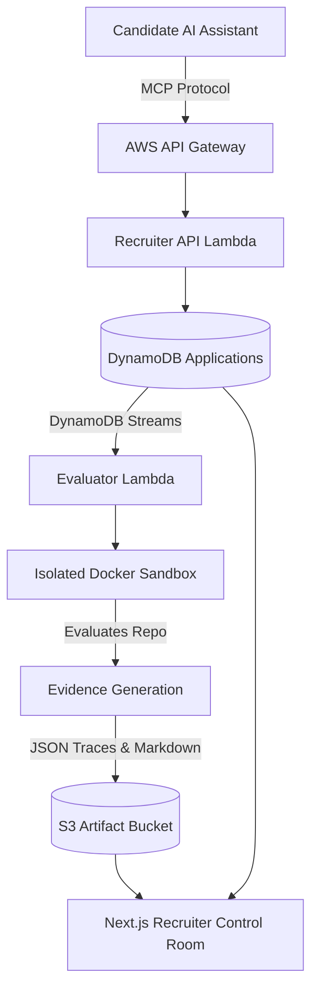

# Agentic - AI-Native Evidence-First Hiring Platform

An evidence-first hiring platform that lets candidates apply through their AI assistants via Model Context Protocol (MCP) and gives recruiters repository-backed technical signals evaluated in an isolated AWS Docker sandbox.

## The Problem

**Hiring is broken for humans.**
Resumes are inherently self-reported and increasingly flooded with AI-generated buzzwords, making it nearly impossible for recruiters to verify technical depth before an interview. At the same time, strong candidates spend countless hours battling ATS parsers instead of demonstrating their actual engineering capabilities.

**Why existing workflows fail:**
Traditional Applicant Tracking Systems (ATS) rely on keyword matching, missing the nuance of real engineering work. They cannot compile an evidence graph of a candidate's actual architecture decisions, Git history, or test rigor. 

## Target Users

- **Technical Recruiters & Hiring Managers:** Need fast, verified signals on a candidate's capabilities to make fair interview decisions.
- **Software Engineering Candidates:** Want to prove their skills through real repository evidence rather than formatting resumes.

---

## Product Workflow

1. **Role Exposure:** Companies expose hiring requisitions via standardized MCP endpoints running on AWS API Gateway.
2. **AI-Assisted Application:** Candidates use Claude, Cursor, or Gemini to connect to the MCP server, discover roles, and submit their GitHub repository as evidence.
3. **AWS Evaluation:** An AWS Lambda workflow securely clones the repository into an isolated Docker sandbox. It evaluates Git forensics, architecture, code smells, and test rigor.
4. **Recruiter Review:** The system generates a Candidate Intelligence Dossier with a "Human Review Required" label, allowing recruiters to inspect verified evidence and OpenTelemetry traces in a dedicated control room.

---

## Architecture Diagram



---

## AWS Services & Usage

- **AWS API Gateway:** Hosts the external-facing Model Context Protocol (MCP) server for candidate agents to interact with.
- **AWS Lambda:** Powers the serverless backend API and the asynchronous evaluator workflow, ensuring isolated scaling per candidate submission.
- **Amazon DynamoDB:** Stores job requisitions and candidate applications with low-latency access.
- **DynamoDB Streams:** Triggers the evaluation Lambda automatically upon a new application insert, decoupling submission from processing.
- **Amazon S3:** Securely stores the generated markdown intelligence reports and OpenTelemetry execution traces.
- **AWS SAM:** Provisions the entire infrastructure as code, managing permissions and routing.

---

## MCP Tools & Candidate Journey

The platform exposes an MCP server (`https://h6aggmskk4.execute-api.ap-south-1.amazonaws.com/mcp`) with the following tools:
- `search_jobs`: Query open roles by keyword and requirements.
- `get_job_requirements`: Retrieve technical rubrics.
- `apply_to_job`: Submit candidate details and repository URL.

Candidates add the MCP configuration to their AI Assistant, prompting it to find a matching job and submit their GitHub profile. 

---

## Evaluation Dimensions

The Docker sandbox evaluates the submitted repository across four dimensions:
1. **Git Forensics:** Verifies commit timeline integrity and author divergence.
2. **SOLID Architecture:** Evaluates separation of concerns and interface design.
3. **Security & Code Smells:** Scans for hardcoded secrets and unhandled edge cases.
4. **Test Rigor:** Measures unit testing coverage and assertion quality.

---

## Local Setup & Demo Mode Instructions

1. **Clone the repository:**
   ```bash
   git clone https://github.com/HaneeNayak31/Hiring-Agent-aws.git
   cd Hiring-Agent-aws/frontend
   ```

2. **Install Dependencies:**
   ```bash
   npm install
   ```

3. **Run the Application:**
   ```bash
   npm run dev
   ```

The application runs at `http://localhost:3000`. By default, the UI utilizes a mock data layer ("Demo Workspace") for immediate presentation and testing without requiring live AWS credentials. 

---

## AWS Deployment

To deploy the backend to your own AWS account:

1. Install the AWS SAM CLI.
2. Authenticate with your AWS account.
3. Deploy the backend:
   ```bash
   cd serverless_backend
   sam build
   sam deploy --guided
   ```

### Environment Variables
For the frontend to connect to your deployed backend, set the following in `frontend/.env.local`:
- `NEXT_PUBLIC_API_URL`: Your deployed API Gateway endpoint.
- `NEXT_PUBLIC_MCP_URL`: Your MCP server endpoint.

---

## Testing Commands

Run frontend linting and build checks:
```bash
cd frontend
npm run lint
npm run build
```

Run backend evaluation tests (Requires Python):
```bash
cd serverless_backend
pytest tests/
```

---

## Known Limitations

- The live Docker sandbox evaluation relies on specific AWS VPC configurations for security, which may require manual tuning depending on repository sizes.
- Real-time OpenTelemetry streaming to the UI has a slight delay due to S3 artifact batching.
- The default UI runs in a "Demo Workspace" mode to ensure reliability during presentations.

---

## Security & Privacy Considerations

- **Isolated Execution:** Candidate code is evaluated within ephemeral Docker containers without outbound network access.
- **Human in the Loop:** The AI evaluator does not make hiring decisions. It surfaces evidence and requires explicit human review.
- **Data Retention:** Evaluation traces are scrubbed of personal identifiers and stored securely in S3 with strict IAM policies.

---

## 3-Minute Demo Script

- **0:00–0:20 (Problem):** "Resumes are noisy. We built Agentic to verify the work behind the resume. We let candidates apply via their AI assistants and evaluate their code in an AWS Docker sandbox."
- **0:20–0:45 (Candidate Discovery):** Show the Candidate UI. "A candidate connects their Cursor or Claude agent to our AWS API Gateway via MCP. The agent discovers the 'Senior Software Engineer' role automatically."
- **0:45–1:15 (Application):** "The agent submits the candidate's GitHub repo. This triggers a DynamoDB stream."
- **1:15–1:50 (AWS Evaluation):** "AWS Lambda catches the stream, spinning up an isolated Docker container to analyze Git forensics, architecture, and code smells."
- **1:50–2:35 (Recruiter View):** Open the Recruiter Control Room. "The recruiter doesn't see a resume. They see an evidence-backed intelligence dossier. Notice the 'Human Review Required' label—the AI provides signals, but humans make the call."
- **2:35–2:55 (Trace/Evidence):** Click into the report to show verified Git forensics and test rigor metrics. 
- **2:55–3:00 (Close):** "This is evidence-first hiring, powered by AWS Serverless and MCP."

---

## What We Learned

- **Decoupling with DynamoDB Streams:** We learned how powerful DynamoDB Streams are for decoupling fast API submissions (MCP) from heavy backend processing (Sandbox Evaluation).
- **LLM Context Limitations:** We learned to pipe OpenTelemetry traces into structured JSON rather than feeding raw terminal logs to the frontend, vastly improving UI performance.
- **UX for AI Actions:** We discovered that recruiters need clear visual distinctions between "AI generated recommendations" and "Verified repository evidence" to trust the system.
